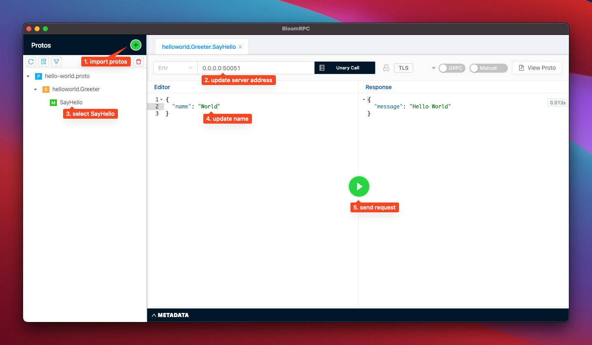

# gRPC Go Hello World

Install golang with asdf

  ``` bash
  brew install asdf
  asdf plugin add golang
  asdf install golang 1.19.1
  asdf local golang <version>
  ```

Install Protocol buffer compiler, protoc, version 3

  ``` bash
  brew install protobuf
  ```

Install Go Plugins for protocol compiler

  ``` bash
  go install google.golang.org/protobuf/cmd/protoc-gen-go@v1.28
  go install google.golang.org/grpc/cmd/protoc-gen-go-grpc@v1.2

  export PATH="$PATH:$(go env GOPATH)/bin"
  ```

Compile proto files

  ``` bash
  protoc --go_out=. --go_opt=paths=source_relative \
    --go-grpc_out=. --go-grpc_opt=paths=source_relative \
    hello-world/hello-world.proto
  ```

Run the Server

  ``` bash
  go run server/main.go
  ```

Run the Client with BloomRPC

  ``` bash
  brew install --cask bloomrpc
  ```

  

Reference:
  - [What is gRPC?](https://grpc.io/docs/what-is-grpc/)
  - [Protocol Buffers](https://developers.google.com/protocol-buffers/docs/overview)
  - [Protocol Buffer Compiler Installation](https://grpc.io/docs/protoc-installation/)
  - [gRPC Go Quick Start](https://grpc.io/docs/languages/go/quickstart/)
  - [grpc 101 with go](https://engineering.teknasyon.com/grpc-101-with-go-6266d9dfdee2)
